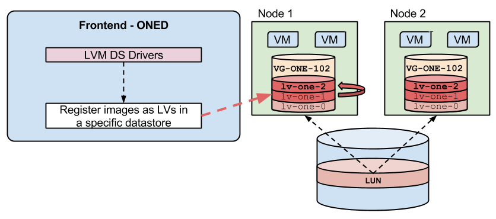

The Block LVM Datastore
=======================

Overview
--------

The Block LVM datastore driver provides OpenNebula with the possibility of using LVM volumes instead of plain files to hold the Virtual Images.

It is assumed that the OpenNebula hosts using this datastore will be configured with CLVM, therefore modifying the OpenNebula Volume Group in one host will reflect in the others. There is a special list of hosts (BRIDGE\_LIST) which belong to the LVM cluster, that will be the ones OpenNebula uses to speak to when doing LVM operations.



Requirements
------------

### OpenNebula Front-end

-   Password-less ssh access to an OpenNebula LVM-enabled host.

### OpenNebula LVM Hosts

LVM must be available in the Hosts. The `oneadmin` user should be able to execute several LVM related commands with sudo passwordlessly.

-   Password-less sudo permission for: `lvremove`, `lvcreate`, `lvs`, `vgdisplay` and `dd`.
-   LVM2
-   `oneadmin` needs to belong to the `disk` group (for KVM).

Configuration
-------------

### Configuring the System Datastore

To use LVM drivers, the system datastore will work both with `shared` or as `ssh`. This sytem datastore will hold only the symbolic links to the block devices, so it will not take much space. See more details on the System Datastore Guide &lt;system\_ds&gt;

It will also be used to hold context images and Disks created on the fly, they will be created as regular files.

### Configuring Block LVM Datastores

The first step to create a LVM datastore is to set up a template file for it.

The specific attributes for this datastore driver are listed in the following table, you will also need to complete with the common datastore attributes &lt;sm\_common\_attributes&gt;:

<table>
<colgroup>
<col width="24%" />
<col width="75%" />
</colgroup>
<thead>
<tr class="header">
<th>Attribute</th>
<th>Description</th>
</tr>
</thead>
<tbody>
<tr class="odd">
<td><code>DS_MAD</code></td>
<td>Must be <code>lvm</code></td>
</tr>
<tr class="even">
<td><code>TM_MAD</code></td>
<td>Must be <code>lvm</code></td>
</tr>
<tr class="odd">
<td><code>DISK_TYPE</code></td>
<td>Must be <code>block</code></td>
</tr>
<tr class="even">
<td><code>VG_NAME</code></td>
<td>The LVM volume group name. Defaults to <code>vg-one</code></td>
</tr>
<tr class="odd">
<td><code>BRIDGE_LIST</code></td>
<td><strong>Mandatory</strong> space separated list of LVM frontends.</td>
</tr>
</tbody>
</table>

For example, the following examples illustrates the creation of an LVM datastore using a configuration file. In this case we will use the host `host01` as one of our OpenNebula LVM-enabled hosts.

``` sourceCode
> cat ds.conf
NAME = production
DS_MAD = lvm
TM_MAD = lvm
VG_NAME = vg-one
BRIDGE_LIST = "host01 host02"

> onedatastore create ds.conf
ID: 100

> onedatastore list
  ID NAME            CLUSTER  IMAGES TYPE   TM
   0 system          none     0      fs     shared
   1 default         none     3      fs     shared
 100 production      none     0      lvm  shared
```

The DS and TM MAD can be changed later using the `onedatastore update` command. You can check more details of the datastore by issuing the `onedatastore show` command.

> **warning**
>
> Note that datastores are not associated to any cluster by default, and they are supposed to be accessible by every single host. If you need to configure datastores for just a subset of the hosts take a look to the Cluster guide &lt;cluster\_guide&gt;.

After creating a new datastore the LN\_TARGET and CLONE\_TARGET parameters will be added to the template. These values should not be changed since they define the datastore behaviour. The default values for these parameters are defined in oned.conf &lt;oned\_conf&gt; for each driver.

### Host Configuration

The hosts must have LVM2 and have the Volume-Group used in the `VG_NAME` attributed of the datastore template. CLVM must also be installed and active accross all the hosts that use this datastore.

It's also required to have password-less sudo permission for: `lvremove`, `lvcreate`, `lvs` and `dd`.

Tuning & Extending
------------------

System administrators and integrators are encouraged to modify these drivers in order to integrate them with their datacenter:

Under `/var/lib/one/remotes/`:

-   **datastore/lvm/lvm.conf**: Default values for LVM parameters
    -   VG\_NAME: Default volume group
    -   DEFAULT\_SIZE: Default size of the snapshots
-   **datastore/lvm/cp**: Registers a new image. Creates a new logical volume in LVM.
-   **datastore/lvm/mkfs**: Makes a new empty image. Creates a new logical volume in LVM.
-   **datastore/lvm/rm**: Removes the LVM logical volume.
-   **tm/lvm/ln**: Links to the LVM logical volume.
-   **tm/lvm/clone**: Clones the image by creating a snapshot.
-   **tm/lvm/mvds**: Saves the image in a new LV for SAVE\_AS.

